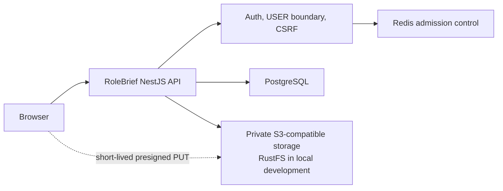
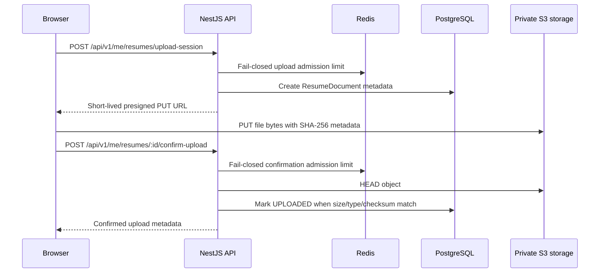
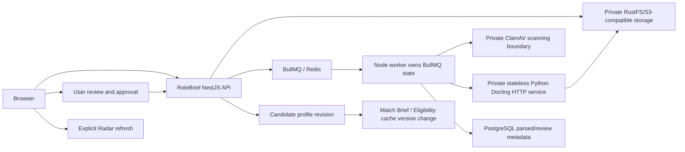

# RoleBrief Architecture

RoleBrief is a career intelligence platform built as a NestJS backend, React frontend, PostgreSQL database, Redis/BullMQ queue layer, and S3-compatible private object storage.

This root README is the canonical cross-system architecture document. Backend and frontend READMEs may describe local details, but new services, providers, workers, queues, storage systems, AI services, and major domains must be represented here.

## Resume Import Foundation

Status: first boundary implemented for secure resume metadata and direct upload. This boundary does not include malware scanning, Docling parsing, preview rendering, profile mutation, or frontend review UI.

### Components



### First-Boundary Flow



### Trust Boundaries

- The browser calls only RoleBrief NestJS domain APIs.
- The browser may upload file bytes directly to private object storage only with a narrowly scoped, short-lived URL issued by NestJS.
- Object keys are server generated and unguessable.
- The API never trusts `userId` from request input; ownership is scoped to the authenticated session user.
- `ADMIN` accounts are blocked from candidate resume endpoints by `UserRoleGuard`.
- Mutations require CSRF protection.
- Upload admission fails closed when Redis admission control is unavailable.

### Current Resume State Boundary

Implemented states for this boundary:

```text
CREATED -> UPLOADING -> UPLOADED
```

Planned next states:

```text
UPLOADED -> VERIFYING -> SCANNING -> VERIFIED_CLEAN -> EXTRACTING -> MAPPING -> READY_FOR_REVIEW
```

Quarantine is an access policy from upload until `VERIFIED_CLEAN`; it is not a transitional status. Uploaded files cannot be parsed or previewed in this first boundary.

### Resume Data Ownership

PostgreSQL stores:

- resume document metadata and state;
- parse attempt metadata for later boundaries;
- extraction draft review JSON for later boundaries;
- provenance-aware candidate career-history tables.

PostgreSQL does not store original resume file bytes.

Candidate career-history models are durable and provenance-aware:

- employment history;
- education;
- projects;
- certifications and licenses;
- languages;
- awards;
- publications;
- links and portfolios.

These models are present so approved resume facts can become durable profile data in later boundaries instead of being trapped only in extraction JSON.

### Local Docker Services

Local development now includes:

- PostgreSQL
- Redis
- RustFS S3-compatible storage
- RustFS bucket init container
- API
- worker
- scheduler

RustFS is development infrastructure only. Business logic uses a generic S3-compatible storage adapter.

### Required Environment Variables

Safe placeholders are documented in `backend/.env.example`.

Resume storage:

```text
RESUME_STORAGE_ENDPOINT=
RESUME_STORAGE_PUBLIC_ENDPOINT=
RESUME_STORAGE_REGION=
RESUME_STORAGE_BUCKET=
RESUME_STORAGE_ACCESS_KEY_ID=
RESUME_STORAGE_SECRET_ACCESS_KEY=
RESUME_STORAGE_FORCE_PATH_STYLE=
RESUME_UPLOAD_MAX_BYTES=
RESUME_UPLOAD_URL_TTL_SECONDS=
RESUME_RATE_LIMIT_UPLOAD_SESSION=
RESUME_RATE_LIMIT_CONFIRM_UPLOAD=
```

No production secret values belong in tracked files.

### Failure And Degraded Modes

- Redis unavailable during upload session or confirmation: return `503` with retry guidance; do not fall through to unbounded PostgreSQL writes.
- Storage unavailable during confirmation: return `503`; keep the document metadata safely in `UPLOADING`.
- Object not found: return `404`.
- Size, content type, or SHA-256 metadata mismatch: reject confirmation and keep the document out of later processing.
- Duplicate upload session with the same idempotency key and same file metadata: replay the session.
- Duplicate upload session with conflicting file metadata: return `409`.

### Retention Lifecycle

This first boundary records upload metadata and object keys. Cleanup workers are planned for later boundaries:

- abandoned `UPLOADING` documents after upload URL expiry;
- rejected or infected objects after scan boundary;
- temporary preview artifacts after preview boundary;
- user-deleted resume objects after delete boundary.

### Migration Rollback Considerations

The migration adds only new resume and career-history tables/enums plus relations from `User` and `CandidateProfile`; existing jobs, auth, saved jobs, tracker, alerts, Radar, Match Brief, and Eligibility data are not rewritten.

Rollback before production traffic:

1. Disable `/api/v1/me/resumes/*` routes or revert the app module registration.
2. Drop the new resume and career-history tables.
3. Drop the new resume/career-history enums.
4. Remove RustFS local service configuration if not needed.
5. Delete orphaned development objects from the configured private bucket.

Rollback after production traffic requires exporting or intentionally deleting user resume metadata and uploaded objects according to the retention policy.

## Planned Full Resume Import Architecture

The full approved architecture remains:



Docling will not be public. The Node worker will call Docling over a private, authenticated, versioned internal HTTP contract with timeouts and payload limits.
