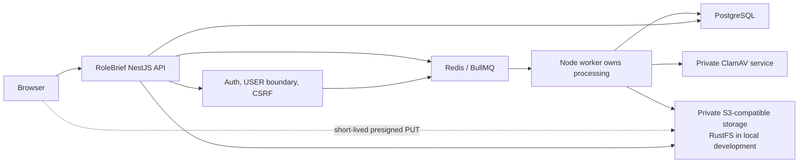
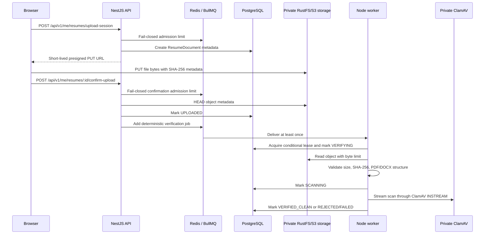
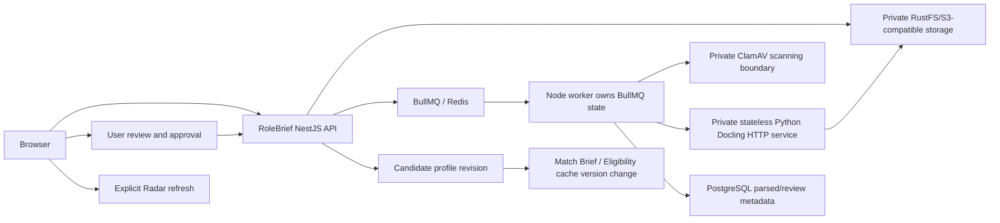

# RoleBrief Architecture

RoleBrief is a career intelligence platform built as a NestJS backend, React frontend, PostgreSQL database, Redis/BullMQ queue layer, private RustFS/S3-compatible object storage, and private worker-only security services.

This root README is the canonical cross-system architecture document. Backend and frontend READMEs may describe local details, but new services, providers, workers, queues, storage systems, AI services, and major domains must be represented here.

## API Documentation

When the backend is running locally, Swagger UI is available at:

```text
http://127.0.0.1:3000/api/docs
```

The OpenAPI document is generated by the NestJS application at startup. Resume Import endpoints are under `/api/v1/me/resumes`.

## Resume Import Boundaries

Status: resume upload, quarantine, trusted byte validation, and private ClamAV malware scanning are implemented. Processing stops at `VERIFIED_CLEAN`.

Not implemented in this boundary: Docling, OCR, parsing, mapping, preview/download access, frontend resume UI, review drafts, profile mutation, Radar refresh, and AI/LLM features.

### Components



RustFS remains the development object-storage server. RoleBrief business logic talks to the generic S3-compatible storage adapter. ClamAV is private to Docker networking and has no public application route.

### Upload And Verification Flow



The browser cannot download, preview, parse, or otherwise access quarantined files. Only future code may proceed from `VERIFIED_CLEAN` to preview or Docling extraction.

### State Transitions

Canonical successful path:

```text
UPLOADING -> UPLOADED -> VERIFYING -> SCANNING -> VERIFIED_CLEAN
```

Permanent rejection branches:

```text
VERIFYING -> REJECTED
SCANNING -> REJECTED
```

Retryable operational branches:

```text
VERIFYING -> FAILED
SCANNING -> FAILED
FAILED -> VERIFYING
```

`DELETED` wins over processing completion. A worker uses a lease token and conditional updates so stale workers cannot overwrite a newer terminal result.

Quarantine is an access policy from upload until `VERIFIED_CLEAN`; it is not a separate transitional state.

### Validation And Scanning

Trusted worker validation reads the stored object bytes, not browser claims. It enforces:

- maximum stored size of 10 MB;
- non-empty file;
- byte-size match;
- streamed SHA-256 match;
- object metadata checksum match;
- PDF `%PDF-` signature, EOF marker, page limit, no encryption, no obvious JavaScript/actions/embedded files;
- DOCX ZIP magic bytes, `[Content_Types].xml`, `word/document.xml`, safe entry paths, entry-count/uncompressed-size/per-entry/compression-ratio limits, no macro projects, no embedded executable processing.

### DOCX validation

DOCX means Office Open XML `.docx`. It is validated as a ZIP/OpenXML archive with safe central-directory parsing. The implementation does not use the incorrect terms ZIPX or DOCXX.

### Safe Failure Codes

Only safe codes are stored and returned. Examples include:

```text
FILE_EMPTY
FILE_TOO_LARGE
SIZE_MISMATCH
CHECKSUM_MISMATCH
SIGNATURE_MISMATCH
PDF_INVALID
PDF_ENCRYPTED
PDF_PAGE_LIMIT_EXCEEDED
DOCX_INVALID
DOCX_ARCHIVE_LIMIT_EXCEEDED
DOCX_UNSAFE_PATH
DOCX_MACRO_UNSUPPORTED
MALWARE_DETECTED
SCANNER_UNAVAILABLE
SCAN_TIMEOUT
STORAGE_UNAVAILABLE
PROCESSING_ATTEMPTS_EXHAUSTED
```

Malware signatures, object keys, signed URLs, original filenames, hashes, and scanner raw output are not exposed to clients.

### Recovery Behavior

- Queue job ID is deterministic by document and SHA-256.
- Duplicate confirmations re-add the same logical job without duplicate final effects.
- Queue publication failure returns `503` with `Retry-After`; the document remains `UPLOADED` and confirmation can be retried.
- Worker processing is at least once; effects are idempotent through conditional state transitions.
- Retryable dependency failures become `FAILED` and can be retried through the owner-scoped retry endpoint.
- Permanent validation and malware failures become `REJECTED` and are not retried as clean candidates.
- Stale leases are recoverable and cannot mark clean after deletion or cancellation.

### Local Docker Services

Local development includes:

- PostgreSQL
- Redis
- RustFS S3-compatible storage
- RustFS bucket init container
- private ClamAV container
- API
- worker
- scheduler

Useful checks:

```bash
docker compose ps
docker compose logs --tail=80 clamav worker api
docker compose exec -T postgres psql -U rolebrief -d rolebrief -c 'select status, count(*) from "ResumeDocument" group by status;'
curl http://127.0.0.1:3000/api/v1/health/ready
curl http://127.0.0.1:3000/api/v1/health/resume-processing
```

Global API readiness checks PostgreSQL and Redis. Resume processing health reports ClamAV degradation separately so unrelated API functionality can remain available while resume scanning fails closed.

### Environment Variables

Safe placeholders are documented in `backend/.env.example`.

Resume storage and processing:

```text
RESUME_STORAGE_ENDPOINT=
RESUME_STORAGE_PUBLIC_ENDPOINT=
RESUME_STORAGE_REGION=
RESUME_STORAGE_BUCKET=
RESUME_STORAGE_ACCESS_KEY_ID=
RESUME_STORAGE_SECRET_ACCESS_KEY=
RESUME_STORAGE_FORCE_PATH_STYLE=
RESUME_UPLOAD_MAX_BYTES=
RESUME_UPLOAD_URL_TTL_SECONDS=
RESUME_RATE_LIMIT_UPLOAD_SESSION=
RESUME_RATE_LIMIT_CONFIRM_UPLOAD=
RESUME_PROCESSING_MAX_ATTEMPTS=
RESUME_PROCESSING_LEASE_SECONDS=
RESUME_PROCESSING_TIMEOUT_MS=
RESUME_PDF_MAX_PAGES=
RESUME_DOCX_MAX_ENTRIES=
RESUME_DOCX_MAX_UNCOMPRESSED_BYTES=
RESUME_DOCX_MAX_ENTRY_BYTES=
RESUME_DOCX_MAX_COMPRESSION_RATIO=
CLAMAV_HOST=
CLAMAV_PORT=
CLAMAV_SCAN_TIMEOUT_MS=
```

No production secret values belong in tracked files.

### Retention And Cleanup

Rejected invalid or infected files are quarantined and assigned `retentionDeleteAt` for cleanup. Cleanup is idempotent and must never expose quarantined files. Abandoned uploads, rejected objects, exhausted failures, deleted documents, and temporary future scan/preview artifacts are cleanup-owned concerns.

### Boundary 2 Closure Evidence

Verified local Docker behavior for this boundary:

- Clean synthetic PDF and DOCX uploads reach `VERIFIED_CLEAN`.
- Invalid renamed DOCX uploads are rejected with `DOCX_INVALID`.
- EICAR test content is rejected with `MALWARE_DETECTED` using the private ClamAV service.
- Cross-user resume status access returns 404.
- Redis outage during upload admission returns 503 with `Retry-After`.
- ClamAV outage returns retryable `FAILED` with `SCANNER_UNAVAILABLE`; files are never marked clean on scanner failure.
- ClamAV recovery allows controlled retry of retryable `FAILED` documents.
- Duplicate queue delivery is idempotent: terminal documents are not rescanned into a second logical result.
- Stale processing leases are reclaimed before verification jobs run.
- Deletion/cancellation wins over stale worker completion because final transitions require the lease token and `deletedAt IS NULL`.
- No preview or download routes are exposed for quarantined, rejected, or clean resumes in this boundary.
- Rejected and infected documents receive a retention cleanup timestamp. Cleanup execution remains a future operational cleanup task.
- Upload-session admission is lightweight validation plus presigning. Local spaced probe: p50 about 50ms, cold max about 200ms. Full upload plus object PUT plus confirm plus scan is naturally slower and should not be treated as admission latency.

### Migration Rollback Considerations

The first resume migration adds resume/career-history models. The scanning migration adds processing lease/scanner metadata and safe failure-code enum values. Existing jobs, auth, saved jobs, tracker, alerts, Radar, Match Brief, and Eligibility data are not rewritten.

Rollback before production traffic:

1. Disable `/api/v1/me/resumes/*` routes or revert the app module registration.
2. Stop the worker and ClamAV services.
3. Drop the scanning metadata columns/indexes if no resume traffic has used them.
4. Drop the new resume and career-history tables only if intentionally removing resume import entirely.
5. Delete orphaned development objects from the configured private bucket.

Rollback after production traffic requires exporting or intentionally deleting user resume metadata and uploaded objects according to retention policy.

## Planned Full Resume Import Architecture

The future architecture still includes Docling and review/profile application, but those are not implemented yet:



Docling will not be public. The Node worker will call Docling over a private, authenticated, versioned internal HTTP contract with timeouts and payload limits in a later boundary.
