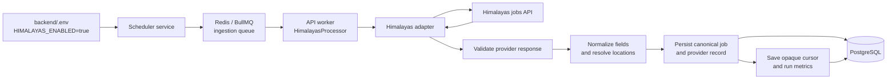
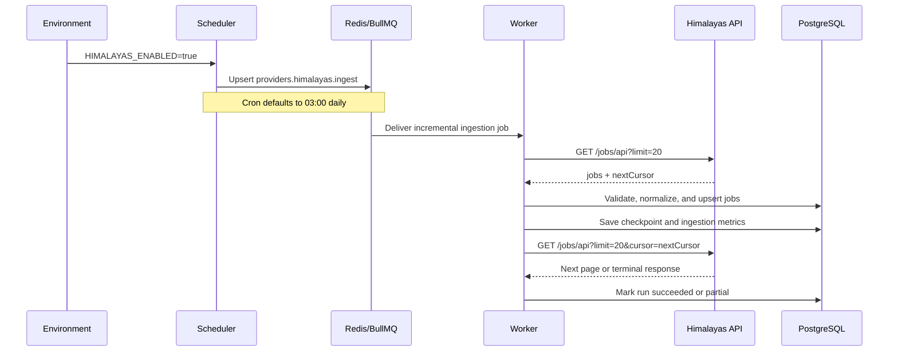
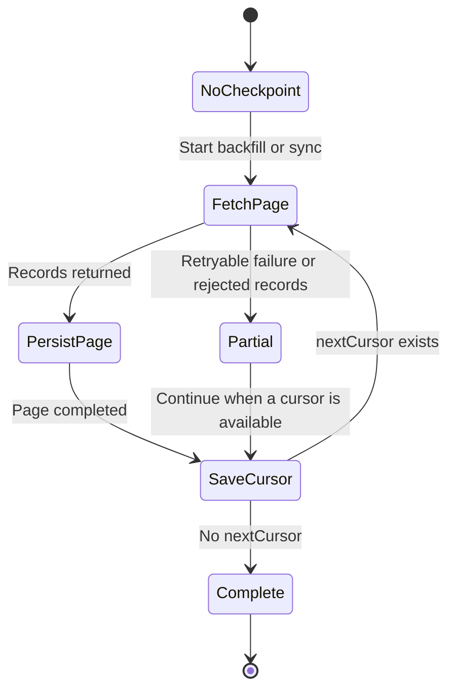
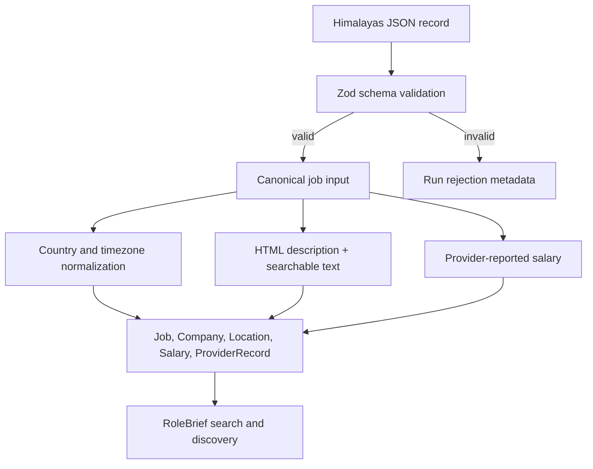
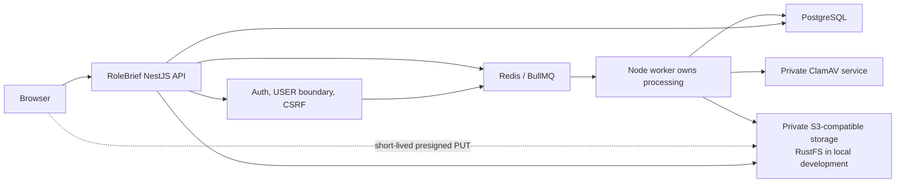
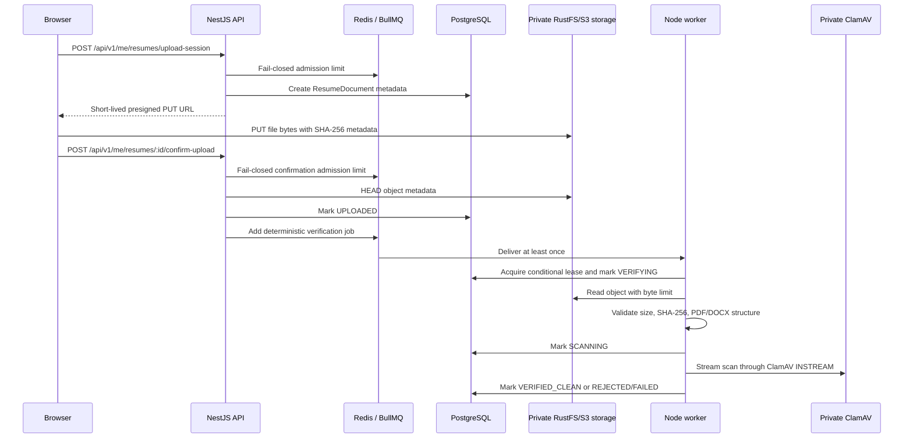
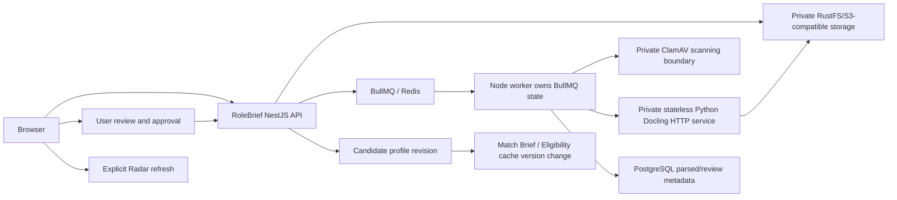

# RoleBrief Architecture

RoleBrief is a career intelligence platform built as a NestJS backend, React frontend, PostgreSQL database, Redis/BullMQ queue layer, private RustFS/S3-compatible object storage, and private worker-only security services.

This root README is the canonical cross-system architecture document. Backend and frontend READMEs may describe local details, but new services, providers, workers, queues, storage systems, AI services, and major domains must be represented here.

## API Documentation

When the backend is running locally, Swagger UI is available at:

```text
http://127.0.0.1:3000/api/docs
```

The OpenAPI document is generated by the NestJS application at startup. Resume Import endpoints are under `/api/v1/me/resumes`.

## Himalayas Provider Ingestion

RoleBrief imports remote job listings from the Himalayas jobs API and converts them into the shared RoleBrief job model. This means the rest of the application can search, filter, save, match, and alert on Himalayas jobs without depending on the provider's response shape.

### Important: API Key Support

The current Himalayas adapter uses the public endpoint configured by `HIMALAYAS_API_URL` and does **not** send an API key. There is currently no `HIMALAYAS_API_KEY` environment variable or authorization header in the implementation. For the current integration, do not invent a key setting: enable the provider with `HIMALAYAS_ENABLED=true` and use the public endpoint.

If Himalayas later requires or provides authenticated API access, the key must be added as a secret environment variable and sent only by the backend adapter. It must never be placed in the frontend, committed to Git, included in job records, or exposed in ingestion-run metadata. The expected future request shape is:

```text
GET https://himalayas.app/jobs/api?limit=20&cursor=<opaque-cursor>
Authorization: Bearer <server-side-secret>
```

Until that authentication change is implemented in the adapter and environment schema, setting an unsupported variable such as `HIMALAYAS_API_KEY` has no effect.

### End-to-End Workflow



In plain language:

1. Configuration decides whether the provider is active.
2. The scheduler creates or updates a recurring BullMQ job using `HIMALAYAS_CRON`.
3. The worker receives the job and asks the adapter for one page at a time.
4. The adapter follows Himalayas' opaque `nextCursor` value and never constructs its own page-number cursor.
5. Each response is schema-validated, normalized, and persisted through the shared job persistence service.
6. The ingestion run records counts, failures, retries, and its stopping reason in PostgreSQL.
7. A checkpoint lets a later backfill continue from the last saved cursor.

### Scheduler And Queue Sequence



The scheduler only schedules work when `HIMALAYAS_ENABLED=true`. If the provider is disabled, no recurring ingestion job is scheduled and a direct ingestion call returns a skipped result without making an HTTP request.

### Configuration

Copy the provider settings into `backend/.env` and adjust them for the environment. The checked-in `backend/.env.example` contains safe defaults:

```dotenv
HIMALAYAS_ENABLED=false
HIMALAYAS_API_URL=https://himalayas.app/jobs/api
HIMALAYAS_PAGE_LIMIT=20
HIMALAYAS_REQUEST_TIMEOUT_MS=15000
HIMALAYAS_INITIAL_BACKFILL_MAX_PAGES=25
HIMALAYAS_SYNC_MAX_PAGES=10
HIMALAYAS_REQUEST_DELAY_MS=3000
HIMALAYAS_UNCHANGED_STOP_THRESHOLD=20
HIMALAYAS_MAX_RETRIES=3
HIMALAYAS_RETRY_DELAY_MS=500
HIMALAYAS_RATE_LIMIT_DELAY_MS=1000
HIMALAYAS_CRON=0 3 * * *
HIMALAYAS_LIVE_SMOKE=false
HIMALAYAS_LIVE_SMOKE_PERSIST=false
```

What each setting controls:

| Setting | Purpose |
| --- | --- |
| `HIMALAYAS_ENABLED` | Master switch. `false` means no HTTP requests and no scheduled ingestion. |
| `HIMALAYAS_API_URL` | Provider endpoint. Defaults to `https://himalayas.app/jobs/api`. |
| `HIMALAYAS_PAGE_LIMIT` | General page limit, constrained by the provider maximum of 20 records per request. |
| `HIMALAYAS_REQUEST_TIMEOUT_MS` | Maximum time allowed for a provider request before it is treated as retryable. |
| `HIMALAYAS_INITIAL_BACKFILL_MAX_PAGES` | Maximum pages for a historical backfill. |
| `HIMALAYAS_SYNC_MAX_PAGES` | Maximum pages for a recurring incremental sync. |
| `HIMALAYAS_REQUEST_DELAY_MS` | Delay between successful page requests to avoid aggressive polling. |
| `HIMALAYAS_UNCHANGED_STOP_THRESHOLD` | Stops an incremental sync after this many unchanged records in a row. |
| `HIMALAYAS_MAX_RETRIES` | Retries for transient provider failures. |
| `HIMALAYAS_RETRY_DELAY_MS` | Base delay between ordinary retries. |
| `HIMALAYAS_RATE_LIMIT_DELAY_MS` | Fallback delay after HTTP `429` when `Retry-After` is absent. |
| `HIMALAYAS_CRON` | Scheduler expression. Default: once daily at 03:00. |
| `HIMALAYAS_LIVE_SMOKE` | Enables the optional live smoke configuration used for a non-persistent connectivity check. |
| `HIMALAYAS_LIVE_SMOKE_PERSIST` | Controls whether smoke-mode records may be persisted. Keep this `false` for a read-only smoke check. |

Never commit real provider credentials or secrets. If authenticated Himalayas access is introduced, store its key in the deployment secret manager and keep it out of this table and all logs.

### Ingestion Modes

The same adapter supports three modes:

| Mode | Intended use | Persists jobs? | Cursor behavior |
| --- | --- | --- | --- |
| `smoke` | Connectivity and response-shape check | No by default | Fetches one record/page |
| `backfill` | Initial historical import | Yes | Resumes from the saved `backfill` checkpoint unless restarted |
| `incremental` | Scheduled daily synchronization | Yes | Starts from the provider's current feed and stops at the terminal cursor or unchanged threshold |

The scheduler uses `incremental`. A backfill is bounded by its configured page limit so an accidental first run cannot fetch indefinitely. A smoke run is intended to prove that the endpoint is reachable and its payload still matches the expected schema without changing job data.

### Cursor, Checkpoint, And Idempotency

Himalayas returns an opaque `nextCursor`. RoleBrief stores it exactly as returned; it is not decoded, sorted, or converted into a page number.



Each provider record is identified by `guid` and stored under the provider key `himalayas.guid`. On later runs:

- the same `guid` updates the existing provider record instead of creating a duplicate;
- a content hash detects whether the normalized job changed;
- unchanged records count toward the incremental stop threshold;
- provider expiry dates can move jobs to `EXPIRED`;
- the checkpoint and run metrics are updated after each completed page;
- a repeated queue delivery is safe because persistence is an upsert-style operation.

### Data Transformation



The main mappings are:

| Himalayas field | RoleBrief result |
| --- | --- |
| `guid` | Provider identity and deduplication key |
| `title` | Canonical job title |
| `companyName`, `companySlug`, `companyLogo` | Company name, slug, and logo |
| `description` and `excerpt` | HTML description and stripped search text |
| `employmentType`, `seniority` | Job classification fields |
| `locationRestrictions` | Resolved countries, labels, and remote scope |
| `timezoneRestrictions` | Timezone labels and normalized offsets |
| `categories`, `parentCategories` | Required skills and search terms |
| `minSalary`, `maxSalary`, `currency`, `salaryPeriod` | Provider-reported salary |
| `pubDate` | Published and source-updated timestamps |
| `expiryDate` | Provider expiry and possible `EXPIRED` status |
| `applicationLink` | Application URL and source attribution |

Location restrictions are deliberately tolerant: the provider may return location objects or strings, and timezone restrictions may arrive as strings or numeric offsets. RoleBrief normalizes both forms and preserves unresolved labels rather than silently discarding them. Empty location restrictions mean worldwide availability.

### Failure And Recovery Behavior

The ingestion run is designed to be observable without exposing provider secrets or raw sensitive payloads:

| Situation | Behavior |
| --- | --- |
| Provider disabled | Run is skipped; no HTTP request or database write for jobs. |
| HTTP `429` | Honors `Retry-After` when present, otherwise uses `HIMALAYAS_RATE_LIMIT_DELAY_MS`, then retries. |
| HTTP `5xx` or timeout | Retries up to `HIMALAYAS_MAX_RETRIES`; the run can finish as partial if pages fail. |
| Other HTTP error | Records a non-retryable failure and stops the affected page. |
| Invalid provider record | Rejects that record, records a bounded reason, and continues with other records. |
| Partial page failure | Persists safe failure metadata and marks the run `partial` rather than hiding the issue. |
| Worker interruption after a page | The last completed page checkpoint remains available for the next backfill. |
| Duplicate record | Updates or marks the existing record unchanged using `guid` and content hashing. |

Provider failure messages are truncated before persistence. API keys, authorization headers, and raw response bodies must never be written to ingestion metadata or logs.

### Verifying The Integration

Start the dependencies and backend, then enable the provider in `backend/.env`:

```bash
docker compose up -d postgres redis rustfs rustfs-init
docker compose up -d api worker scheduler
```

Useful checks:

```bash
# Confirm the API and its dependencies are ready.
curl http://127.0.0.1:3000/api/v1/health/ready

# Confirm the provider's scanning/worker health boundary is separate from API readiness.
curl http://127.0.0.1:3000/api/v1/health/resume-processing

# Inspect scheduled services and recent ingestion logs.
docker compose ps
docker compose logs --tail=100 scheduler worker api

# Inspect ingestion-run outcomes and checkpoint state.
docker compose exec -T postgres psql -U rolebrief -d rolebrief -c 'select "providerId", mode, status, "recordsFetched", "recordsCreated", "recordsUpdated", "recordsRejected", "stopReason", "finishedAt" from "IngestionRun" order by "createdAt" desc limit 10;'
docker compose exec -T postgres psql -U rolebrief -d rolebrief -c 'select "providerId", mode, cursor, "updatedAt" from "IngestionCheckpoint" where "providerId" = '\''himalayas.guid'\'';'
```

Expected healthy behavior is a completed or partial run with page and record counts, a saved checkpoint for backfill/incremental processing, and no secret values in logs. A partial run is not automatically a total failure: inspect its retry count, rejection count, failure metadata, and stopping reason before rerunning.

### Troubleshooting Checklist

1. If there are no ingestion jobs, check that `HIMALAYAS_ENABLED=true` is present in the environment used by the scheduler container, not only in a local shell.
2. If the scheduler says the provider is disabled, recreate the service after changing `.env`: `docker compose up -d --force-recreate scheduler`.
3. If requests fail, test the configured endpoint from the API container and inspect HTTP status, timeout, and retry messages.
4. If records are rejected, compare the provider response shape with the Zod DTO and the field mapping document at `backend/docs/himalayas-field-mapping.md`.
5. If a backfill resumes unexpectedly, inspect the `himalayas.guid` / `backfill` checkpoint; use the supported restart path rather than manually editing cursors.
6. If a key is required by a future provider contract, do not add it only to `.env`; the adapter and environment schema must be updated together so the key is validated, sent securely, and never logged.

## Resume Import Boundaries

Status: resume upload, quarantine, trusted byte validation, and private ClamAV malware scanning are implemented. Processing stops at `VERIFIED_CLEAN`.

Not implemented in this boundary: Docling, OCR, parsing, mapping, preview/download access, frontend resume UI, review drafts, profile mutation, Radar refresh, and AI/LLM features.

### Components



RustFS remains the development object-storage server. RoleBrief business logic talks to the generic S3-compatible storage adapter. ClamAV is private to Docker networking and has no public application route.

### Upload And Verification Flow



The browser cannot download, preview, parse, or otherwise access quarantined files. Only future code may proceed from `VERIFIED_CLEAN` to preview or Docling extraction.

### State Transitions

Canonical successful path:

```text
UPLOADING -> UPLOADED -> VERIFYING -> SCANNING -> VERIFIED_CLEAN
```

Permanent rejection branches:

```text
VERIFYING -> REJECTED
SCANNING -> REJECTED
```

Retryable operational branches:

```text
VERIFYING -> FAILED
SCANNING -> FAILED
FAILED -> VERIFYING
```

`DELETED` wins over processing completion. A worker uses a lease token and conditional updates so stale workers cannot overwrite a newer terminal result.

Quarantine is an access policy from upload until `VERIFIED_CLEAN`; it is not a separate transitional state.

### Validation And Scanning

Trusted worker validation reads the stored object bytes, not browser claims. It enforces:

- maximum stored size of 10 MB;
- non-empty file;
- byte-size match;
- streamed SHA-256 match;
- object metadata checksum match;
- PDF `%PDF-` signature, EOF marker, page limit, no encryption, no obvious JavaScript/actions/embedded files;
- DOCX ZIP magic bytes, `[Content_Types].xml`, `word/document.xml`, safe entry paths, entry-count/uncompressed-size/per-entry/compression-ratio limits, no macro projects, no embedded executable processing.

### DOCX validation

DOCX means Office Open XML `.docx`. It is validated as a ZIP/OpenXML archive with safe central-directory parsing. The implementation does not use the incorrect terms ZIPX or DOCXX.

### Safe Failure Codes

Only safe codes are stored and returned. Examples include:

```text
FILE_EMPTY
FILE_TOO_LARGE
SIZE_MISMATCH
CHECKSUM_MISMATCH
SIGNATURE_MISMATCH
PDF_INVALID
PDF_ENCRYPTED
PDF_PAGE_LIMIT_EXCEEDED
DOCX_INVALID
DOCX_ARCHIVE_LIMIT_EXCEEDED
DOCX_UNSAFE_PATH
DOCX_MACRO_UNSUPPORTED
MALWARE_DETECTED
SCANNER_UNAVAILABLE
SCAN_TIMEOUT
STORAGE_UNAVAILABLE
PROCESSING_ATTEMPTS_EXHAUSTED
```

Malware signatures, object keys, signed URLs, original filenames, hashes, and scanner raw output are not exposed to clients.

### Recovery Behavior

- Queue job ID is deterministic by document and SHA-256.
- Duplicate confirmations re-add the same logical job without duplicate final effects.
- Queue publication failure returns `503` with `Retry-After`; the document remains `UPLOADED` and confirmation can be retried.
- Worker processing is at least once; effects are idempotent through conditional state transitions.
- Retryable dependency failures become `FAILED` and can be retried through the owner-scoped retry endpoint.
- Permanent validation and malware failures become `REJECTED` and are not retried as clean candidates.
- Stale leases are recoverable and cannot mark clean after deletion or cancellation.

### Local Docker Services

Local development includes:

- PostgreSQL
- Redis
- RustFS S3-compatible storage
- RustFS bucket init container
- private ClamAV container
- API
- worker
- scheduler

Useful checks:

```bash
docker compose ps
docker compose logs --tail=80 clamav worker api
docker compose exec -T postgres psql -U rolebrief -d rolebrief -c 'select status, count(*) from "ResumeDocument" group by status;'
curl http://127.0.0.1:3000/api/v1/health/ready
curl http://127.0.0.1:3000/api/v1/health/resume-processing
```

Global API readiness checks PostgreSQL and Redis. Resume processing health reports ClamAV degradation separately so unrelated API functionality can remain available while resume scanning fails closed.

### Environment Variables

Safe placeholders are documented in `backend/.env.example`.

Resume storage and processing:

```text
RESUME_STORAGE_ENDPOINT=
RESUME_STORAGE_PUBLIC_ENDPOINT=
RESUME_STORAGE_REGION=
RESUME_STORAGE_BUCKET=
RESUME_STORAGE_ACCESS_KEY_ID=
RESUME_STORAGE_SECRET_ACCESS_KEY=
RESUME_STORAGE_FORCE_PATH_STYLE=
RESUME_UPLOAD_MAX_BYTES=
RESUME_UPLOAD_URL_TTL_SECONDS=
RESUME_RATE_LIMIT_UPLOAD_SESSION=
RESUME_RATE_LIMIT_CONFIRM_UPLOAD=
RESUME_PROCESSING_MAX_ATTEMPTS=
RESUME_PROCESSING_LEASE_SECONDS=
RESUME_PROCESSING_TIMEOUT_MS=
RESUME_PDF_MAX_PAGES=
RESUME_DOCX_MAX_ENTRIES=
RESUME_DOCX_MAX_UNCOMPRESSED_BYTES=
RESUME_DOCX_MAX_ENTRY_BYTES=
RESUME_DOCX_MAX_COMPRESSION_RATIO=
CLAMAV_HOST=
CLAMAV_PORT=
CLAMAV_SCAN_TIMEOUT_MS=
```

No production secret values belong in tracked files.

### Retention And Cleanup

Rejected invalid or infected files are quarantined and assigned `retentionDeleteAt` for cleanup. Cleanup is idempotent and must never expose quarantined files. Abandoned uploads, rejected objects, exhausted failures, deleted documents, and temporary future scan/preview artifacts are cleanup-owned concerns.

### Boundary 2 Closure Evidence

Verified local Docker behavior for this boundary:

- Clean synthetic PDF and DOCX uploads reach `VERIFIED_CLEAN`.
- Invalid renamed DOCX uploads are rejected with `DOCX_INVALID`.
- EICAR test content is rejected with `MALWARE_DETECTED` using the private ClamAV service.
- Cross-user resume status access returns 404.
- Redis outage during upload admission returns 503 with `Retry-After`.
- ClamAV outage returns retryable `FAILED` with `SCANNER_UNAVAILABLE`; files are never marked clean on scanner failure.
- ClamAV recovery allows controlled retry of retryable `FAILED` documents.
- Duplicate queue delivery is idempotent: terminal documents are not rescanned into a second logical result.
- Stale processing leases are reclaimed before verification jobs run.
- Deletion/cancellation wins over stale worker completion because final transitions require the lease token and `deletedAt IS NULL`.
- No preview or download routes are exposed for quarantined, rejected, or clean resumes in this boundary.
- Rejected and infected documents receive a retention cleanup timestamp. Cleanup execution remains a future operational cleanup task.
- Upload-session admission is lightweight validation plus presigning. Local spaced probe: p50 about 50ms, cold max about 200ms. Full upload plus object PUT plus confirm plus scan is naturally slower and should not be treated as admission latency.

### Migration Rollback Considerations

The first resume migration adds resume/career-history models. The scanning migration adds processing lease/scanner metadata and safe failure-code enum values. Existing jobs, auth, saved jobs, tracker, alerts, Radar, Match Brief, and Eligibility data are not rewritten.

Rollback before production traffic:

1. Disable `/api/v1/me/resumes/*` routes or revert the app module registration.
2. Stop the worker and ClamAV services.
3. Drop the scanning metadata columns/indexes if no resume traffic has used them.
4. Drop the new resume and career-history tables only if intentionally removing resume import entirely.
5. Delete orphaned development objects from the configured private bucket.

Rollback after production traffic requires exporting or intentionally deleting user resume metadata and uploaded objects according to retention policy.

## Planned Full Resume Import Architecture

The future architecture still includes Docling and review/profile application, but those are not implemented yet:



Docling will not be public. The Node worker will call Docling over a private, authenticated, versioned internal HTTP contract with timeouts and payload limits in a later boundary.
