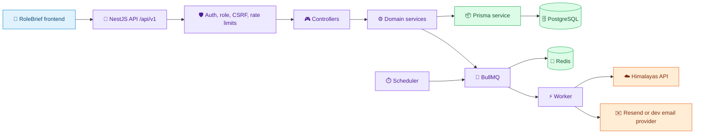
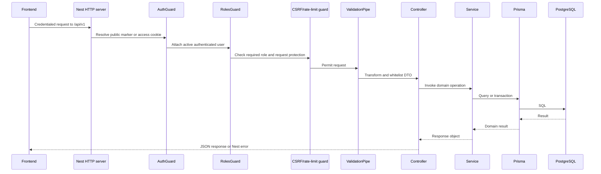
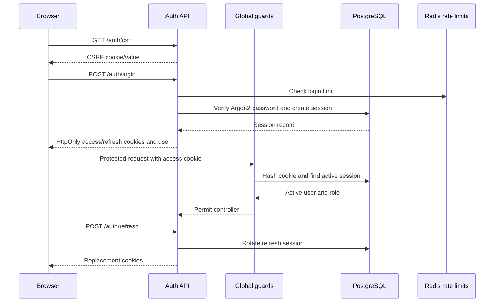
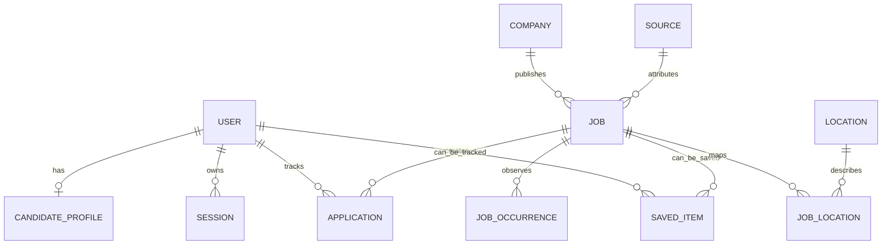
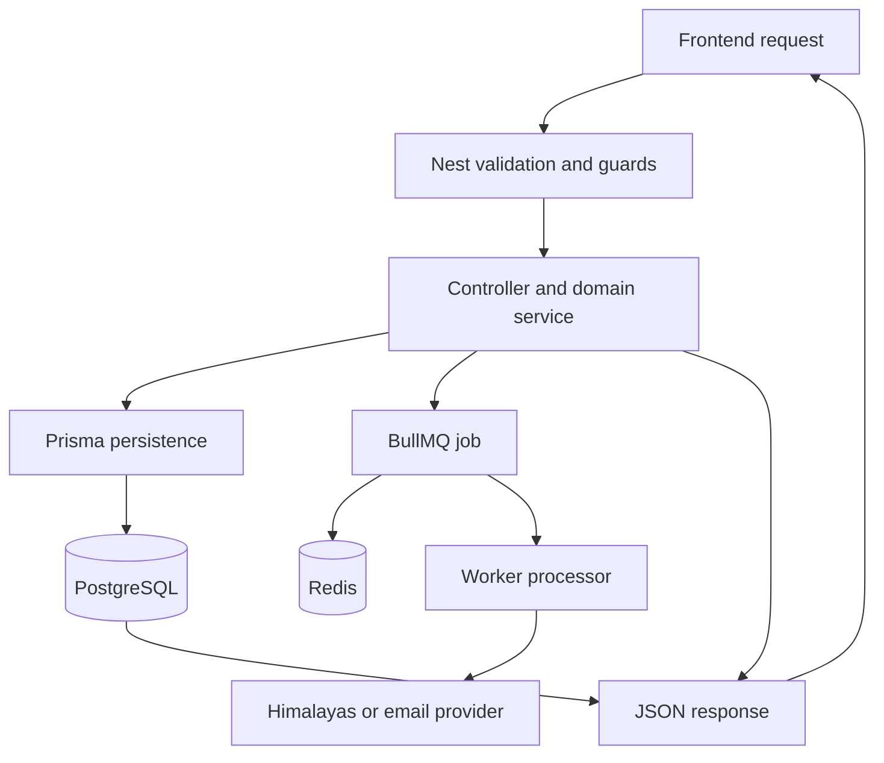
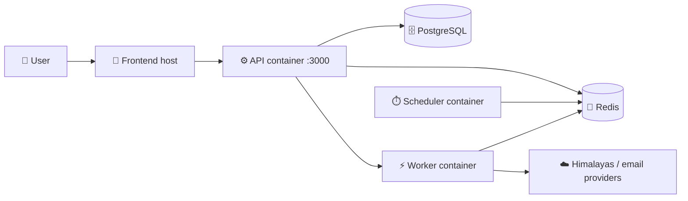

<!--
AI AGENTS:
This README is living technical documentation. Read it before modifying this application.
Update it when implementation changes documented behavior. Do not allow documentation drift.
-->

<div align="center">

# RoleBrief

### Backend Platform

**Provider-neutral career intelligence API and processing platform.**

[](https://nestjs.com/)
[](https://nodejs.org/)
[](https://www.postgresql.org/)
[](https://www.prisma.io/)
[](https://redis.io/)
[](https://pnpm.io/)

[Frontend Documentation](../frontend/README.md) · [Root Compose](../docker-compose.yml) · [Field Mapping](docs/himalayas-field-mapping.md)

</div>

> **Documentation status:** living documentation reviewed against the current repository on **2026-09-09**.

## 🧭 Navigation

[Overview](#-overview) · [Architecture](#️-architecture) · [Domains](#-domain--module-map) · [API](#-api-architecture) · [Auth](#-authentication--authorization) · [Database](#️-database-architecture) · [Jobs](#-background-processing) · [Config](#️-environment-variables) · [Setup](#-local-development) · [Testing](#-testing) · [Deployment](#-deployment) · [AI Protocol](#-ai-agent-documentation-protocol)

## 🌟 Overview

RoleBrief's backend is a NestJS modular monolith that powers job discovery and candidate workflows. It exposes a versioned HTTP API, persists identity, jobs, candidate activity, and ingestion history in PostgreSQL through Prisma, uses Redis for rate limits and BullMQ, and runs provider ingestion and email delivery outside the API process.

There are three process entrypoints:

| Process | Entrypoint | Responsibility |
| --- | --- | --- |
| API | `src/main.ts` | HTTP requests, validation, auth, domain services, Swagger, health checks |
| Worker | `src/worker.ts` | BullMQ consumers for Himalayas ingestion and auth email delivery |
| Scheduler | `src/scheduler.ts` | Registers recurring Himalayas ingestion jobs |

## 🏗️ Architecture



**Source map**

| Responsibility | Source |
| --- | --- |
| API bootstrap, CORS, Helmet, validation, Swagger | [`src/main.ts`](src/main.ts) |
| Application module registration | [`src/app.module.ts`](src/app.module.ts) |
| Worker and scheduler bootstraps | [`src/worker.ts`](src/worker.ts), [`src/scheduler.ts`](src/scheduler.ts) |
| Configuration validation and access | [`src/common/config`](src/common/config) |
| Prisma client/module | [`src/prisma`](src/prisma) |
| Queues and Redis wiring | [`src/queue`](src/queue) |
| Provider adapters and persistence | [`src/providers`](src/providers) |
| Database schema and migrations | [`prisma/schema.prisma`](prisma/schema.prisma), [`prisma/migrations`](prisma/migrations) |
| Container build and runtime | [`Dockerfile`](Dockerfile), [`../docker-compose.yml`](../docker-compose.yml) |

## 🗂️ Project Structure

```text
backend/
├── src/
│   ├── auth/              Cookies, sessions, password, CSRF, RBAC, email
│   ├── admin/             Admin user-management controller/module
│   ├── common/            Config, logging, and shared rate-limit support
│   ├── health/            Liveness and PostgreSQL/Redis readiness checks
│   ├── modules/           Jobs, saved, tracker, profile, onboarding, and boundaries
│   ├── providers/         Himalayas adapter, orchestration, normalization, persistence
│   ├── queue/             BullMQ registration, constants, and Redis probe
│   ├── scheduler/         Recurring ingestion scheduling
│   ├── prisma/            Prisma module and service
│   ├── main.ts            API process
│   ├── worker.ts          Worker process
│   └── scheduler.ts       Scheduler process
├── prisma/
│   ├── schema.prisma      PostgreSQL data model
│   └── migrations/        Versioned migrations
├── docs/                  Provider field-mapping documentation
├── Dockerfile             Multi-stage Node 22 image
└── package.json            Scripts and dependencies
```

## 🧩 Domain & Module Map

| Domain | Responsibility | Important implementation |
| --- | --- | --- |
| Authentication | Account lifecycle, sessions, verification, recovery, password changes | [`src/auth`](src/auth) |
| Administration | Admin user listing and role/status changes | [`src/admin`](src/admin) |
| Jobs | Public filtered job search, facets, details, and related jobs | [`src/modules/jobs`](src/modules/jobs) |
| Saved jobs | Per-user saved job reads and mutations | [`src/modules/saved`](src/modules/saved) |
| Tracker | User-owned applications, stages, history, archive/restore, revisions | [`src/modules/tracker`](src/modules/tracker) |
| Onboarding | Candidate workflow progress and autosave | [`src/modules/onboarding`](src/modules/onboarding) |
| Profile | Candidate profile, preferences, skills, and completeness | [`src/modules/profile`](src/modules/profile) |
| Ingestion | Provider validation, normalization, checkpoints, metrics, persistence | [`src/providers`](src/providers), [`src/ingestion`](src/ingestion) |
| Email | Verification, recovery, and password notifications | [`src/auth/email`](src/auth/email) |
| Health | Process liveness and dependency readiness | [`src/health`](src/health) |

`NewsModule`, `CompaniesModule`, `MatchingModule`, `EligibilityModule`, and `AlertsModule` are registered module boundaries, but the current backend has no controllers for them. The frontend's corresponding screens must therefore be treated as fixture-backed or local-only until API implementations exist.

## 🔄 Request Lifecycle



`main.ts` applies credentialed exact-origin CORS, Helmet, cookie parsing, the `/api/v1` prefix, and a global validation pipe. Public endpoints opt out through `@Public()`; other routes require a valid active session.

## 🔌 API Architecture

The API is versioned through the global `/api/v1` prefix. DTOs are validated with `class-validator` and transformed by Nest's `ValidationPipe`; non-whitelisted fields are rejected. Swagger is served at `/api/docs`.

| Domain | Base route | Authentication | Purpose |
| --- | --- | --- | --- |
| Health | `/health` | Public | Liveness and PostgreSQL/Redis readiness |
| Auth | `/auth` | Mixed | Signup, login, cookies, refresh, verification, recovery, sessions |
| Jobs | `/jobs` | Public | Filtered search, facets, details, related jobs |
| Saved | `/saved` | Session; CSRF for mutations | Saved job reads and mutations |
| Onboarding | `/me/onboarding` | Session; CSRF for writes | Candidate workflow state and autosave |
| Profile | `/me/profile` | Session; CSRF for writes | Candidate profile and preferences |
| Tracker | `/tracker` | Session; CSRF for mutations | Applications, stages, notes, archive, restore |
| Admin | `/admin` | `ADMIN`; CSRF for mutations | User status and role administration |

Jobs and tracker responses support cursor-oriented pagination. Tracker mutations include expected revisions and can return conflicts when a client writes against stale state. Nest exceptions provide structured HTTP errors; services also use ownership checks before returning or mutating user-owned records.

## 🔐 Authentication & Authorization

RoleBrief uses email/password authentication with Argon2 password hashes and opaque, database-backed session cookies. The browser receives access and refresh cookies; raw token values are not persisted in the database. Access and refresh lifetimes are separate, refresh sessions rotate, and sessions can be revoked individually or globally.



Verified controls:

- `AuthGuard` requires an active, unexpired, non-revoked access session unless a route is public.
- `RolesGuard` enforces `Role.ADMIN` on admin routes.
- `CsrfGuard` protects state-changing authenticated operations using the `rb_csrf` cookie and `x-rolebrief-csrf` header.
- Exact-origin credentialed CORS is configured through `FRONTEND_ORIGIN`; wildcard origins are not used.
- Login, signup, recovery, refresh, and tracker operations use Redis-backed limits.
- Recovery responses are generic to reduce account enumeration.
- Session and auth events are audited; verification/reset tokens are stored as hashes.

## 🗄️ Database Architecture

PostgreSQL is accessed through Prisma. The canonical schema is [`prisma/schema.prisma`](prisma/schema.prisma); migrations are versioned under [`prisma/migrations`](prisma/migrations), and seed logic is [`prisma/seed.ts`](prisma/seed.ts).

| Entity group | Important models |
| --- | --- |
| Identity and auth | `User`, `Session`, `EmailVerificationToken`, `PasswordResetToken`, `AuthAuditEvent`, `EmailDelivery` |
| Job catalog | `Company`, `Job`, `Location`, `JobLocation`, `Source`, `ProviderRecord`, `JobOccurrence`, `Salary` |
| Candidate activity | `SavedItem`, `Application`, `ApplicationHistory`, `Alert`, `AlertDelivery` |
| Candidate profile | `OnboardingProgress`, `CandidateProfile`, `CandidatePreference`, `CandidateSkill` |
| Ingestion/audit | `IngestionRun`, `IngestionCheckpoint`, `FreshnessEvent`, `AuditEvent` |



The schema uses indexes for common job status/filter paths, user role/status, session expiry/revocation, provider identity, and user-owned activity. Tracker writes use revision checks for optimistic concurrency; related services use Prisma operations and transactions where required by the domain.

## 📊 Data Flow



## ⚡ Background Processing

The queue boundary is registered in [`src/queue/queue.constants.ts`](src/queue/queue.constants.ts): `ingestion`, `verification`, `enrichment`, `alerts`, and `delivery`. Currently registered processors consume:

- `providers.himalayas.ingest`: provider fetch, validation, normalization, persistence, checkpoint updates, and run metrics.
- `auth.email.send`: queued verification, recovery, and password-change delivery.

The scheduler upserts the recurring Himalayas job using `HIMALAYAS_CRON` when `HIMALAYAS_ENABLED=true`. Ingestion supports smoke, incremental, and backfill modes, page limits, request delays, retry settings, unchanged-record stopping, and persisted checkpoints. The repository does not define a separate dead-letter queue; failed/partial ingestion details are recorded in ingestion-run metadata and queue failure retention is configured for the scheduled job.

## 🔌 External Integrations

| Service | Purpose | Configuration |
| --- | --- | --- |
| PostgreSQL | Primary relational database | `DATABASE_URL` |
| Redis | Queue backing store, readiness probe, and rate limits | `REDIS_URL` |
| Himalayas | Job provider ingestion | `HIMALAYAS_*` variables |
| Resend | Optional production email delivery | `EMAIL_PROVIDER`, `RESEND_*` variables |
| Development email provider | Local/test email behavior | `EMAIL_PROVIDER=dev` |

No credentials or provider values are included here.

## ⚙️ Environment Variables

The tracked template is [`backend/.env.example`](.env.example). Copy it to `.env` and supply local values without committing secrets.

| Group | Variables |
| --- | --- |
| Runtime | `NODE_ENV`, `PORT`, `LOG_LEVEL` |
| Browser/API | `PUBLIC_APP_URL`, `FRONTEND_ORIGIN` |
| Persistence | `DATABASE_URL`, `DATABASE_POOL_SIZE`, `REDIS_URL` |
| Queues | `QUEUE_PREFIX`, `WORKER_CONCURRENCY` |
| Authentication | `AUTH_ISSUER`, `AUTH_AUDIENCE`, `SESSION_SECRET`, `CURSOR_SIGNING_SECRET`, `ACCESS_TOKEN_TTL`, `REFRESH_SESSION_TTL`, `COOKIE_SECURE`, `COOKIE_SAME_SITE` |
| Limits | `AUTH_RATE_LIMIT_LOGIN`, `AUTH_RATE_LIMIT_SIGNUP`, `AUTH_RATE_LIMIT_RECOVERY`, `AUTH_RATE_LIMIT_REFRESH`, `TRACKER_RATE_LIMIT_READ`, `TRACKER_RATE_LIMIT_MUTATE`, `TRACKER_RATE_LIMIT_DELETE`, `RATE_LIMIT_FAIL_CLOSED` |
| Email | `EMAIL_PROVIDER`, `EMAIL_DELIVERY_ENABLED`, `EMAIL_EXPOSE_DEV_LINKS`, `EMAIL_FROM`, `RESEND_FROM_EMAIL`, `RESEND_REPLY_TO`, `SMTP_URL`, `RESEND_API_KEY` |
| Admin bootstrap | `BOOTSTRAP_ADMIN_ENABLED`, `BOOTSTRAP_ADMIN_EMAIL`, `BOOTSTRAP_ADMIN_PASSWORD` |
| Himalayas | `HIMALAYAS_ENABLED`, `HIMALAYAS_API_URL`, `HIMALAYAS_PAGE_LIMIT`, `HIMALAYAS_REQUEST_TIMEOUT_MS`, `HIMALAYAS_INITIAL_BACKFILL_MAX_PAGES`, `HIMALAYAS_SYNC_MAX_PAGES`, `HIMALAYAS_REQUEST_DELAY_MS`, `HIMALAYAS_UNCHANGED_STOP_THRESHOLD`, `HIMALAYAS_MAX_RETRIES`, `HIMALAYAS_RETRY_DELAY_MS`, `HIMALAYAS_RATE_LIMIT_DELAY_MS`, `HIMALAYAS_CRON`, `HIMALAYAS_LIVE_SMOKE`, `HIMALAYAS_LIVE_SMOKE_PERSIST` |
| Optional integrations | `APITUBE_API_KEY`, `OTEL_EXPORTER_OTLP_ENDPOINT`, `SENTRY_DSN` |

## 🚀 Local Development

### Requirements and installation

Node.js 22 is used by the Docker build. The backend declares `pnpm@11.18.0` and includes a pnpm lockfile.

```powershell
cd backend
Copy-Item .env.example .env
pnpm install
```

### Start PostgreSQL and Redis

From the repository root:

```powershell
docker compose up -d postgres redis
```

### Generate, migrate, and seed

```powershell
cd backend
pnpm prisma:generate
pnpm migrate:dev
pnpm db:seed
```

Use `pnpm migrate:deploy` for an existing database and `pnpm exec prisma studio` for inspection. Seeding is optional and should be run when the current environment needs seed data.

### Run processes

Use separate terminals as needed:

```powershell
pnpm dev:api
pnpm dev:worker
pnpm dev:scheduler
```

For a frontend-only workflow, the API is the required process. Worker and scheduler are needed for queued email delivery and recurring ingestion behavior. The API listens on port `3000` by default; health endpoints are `/api/v1/health/live` and `/api/v1/health/ready`, and Swagger is `/api/docs`.

### Build and start compiled processes

```powershell
pnpm build
pnpm start:api
pnpm start:worker
pnpm start:scheduler
```

### Bootstrap an administrator

The bootstrap command reads `BOOTSTRAP_ADMIN_ENABLED`, `BOOTSTRAP_ADMIN_EMAIL`, and `BOOTSTRAP_ADMIN_PASSWORD` from the environment. Keep the password only in an untracked local or deployment secret store.

## 🧪 Testing

```powershell
pnpm test
pnpm typecheck
pnpm lint
```

Tests use Node's built-in test runner with `tsx`. Coverage includes auth cookies/session behavior, email configuration and templates, jobs, onboarding, saved jobs, tracker, HTML sanitization, Himalayas DTO/adapter/normalization/ingestion, and scheduler behavior. The jobs integration test requires a configured PostgreSQL `DATABASE_URL`; live Himalayas smoke behavior is opt-in through its environment variables.

## 📦 Deployment

The repository verifies a Docker deployment shape for the backend:



[`docker-compose.yml`](../docker-compose.yml) defines `postgres`, `redis`, `api`, `worker`, `scheduler`, and optional `migrate`, `seed`, and `adminer` tools. The multi-stage [`Dockerfile`](Dockerfile) builds with Node 22, generates Prisma, compiles Nest, exposes port `3000`, and runs the API by default. Compose overrides the command for worker and scheduler services. No CI/CD provider, managed hosting platform, or frontend deployment target is present in the repository, so those operational details remain intentionally undocumented.

## 🛡️ Security

Verified controls include Argon2 password hashing, hashed session and recovery tokens, HttpOnly cookies, refresh rotation and revocation, global authentication and role guards, CSRF protection, exact-origin credentialed CORS, Helmet headers, DTO validation with whitelist/forbid behavior, Redis-backed rate limits, generic recovery responses, account status checks, ownership checks in user domains, structured logging, and auth audit records. Secret values remain in untracked environment configuration.

## 🤖 AI Agent Documentation Protocol

This README is living technical documentation and part of the project's source of truth.

**Before making changes:**

1. Read this README.
2. Inspect the relevant implementation, schema, configuration, and neighboring tests.
3. Identify whether the change affects architecture, domains, APIs, authentication, authorization, database structures, queues, integrations, environment variables, setup, deployment, or security.

**After implementation:**

1. Update this README whenever implementation changes documented behavior.
2. Update affected Mermaid diagrams and source maps.
3. Update domain/module and API tables.
4. Update database/ERD documentation when schema changes.
5. Update environment variables and setup commands when configuration/tooling changes.
6. Remove documentation for functionality that no longer exists.
7. Never document planned behavior as implemented behavior.

If this README disagrees with the implementation, treat the implementation as the current source of truth, verify the behavior, and update this README as part of the same change boundary whenever practical. Do not silently continue with known stale documentation.

### AI Agent Change Checklist

| Change made | README action |
| --- | --- |
| New feature or changed domain | Update domain map, features/flows, and diagrams |
| New or changed API route | Update API architecture table and request flow |
| API contract changed | Update DTO/response, frontend communication, and tests notes |
| New database entity or relationship | Update database section and ERD |
| Authentication changed | Update auth section and sequence diagram |
| Authorization changed | Update roles, guards, and access table |
| New environment variable | Update Environment Variables and setup |
| New integration | Update Integrations and data-flow diagram |
| Queue/worker/scheduler changed | Update Background Processing and architecture diagrams |
| Deployment changed | Update Docker/deployment section |
| Folder/module moved | Update Project Structure and source map |
| Security behavior changed | Update Security and auth documentation |

## 📌 Documentation Status

- **Last architecture review:** 2026-09-09
- **Documentation scope:** Backend
- **Source of truth:** Current repository implementation
- **Maintenance:** Required with architecture-affecting changes
- **Unverified by repository:** CI/CD provider, managed hosting, production topology, frontend hosting, and realtime/WebSocket infrastructure
