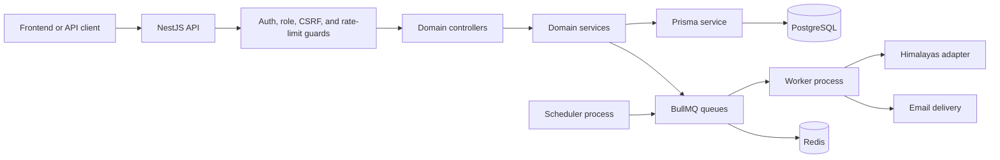
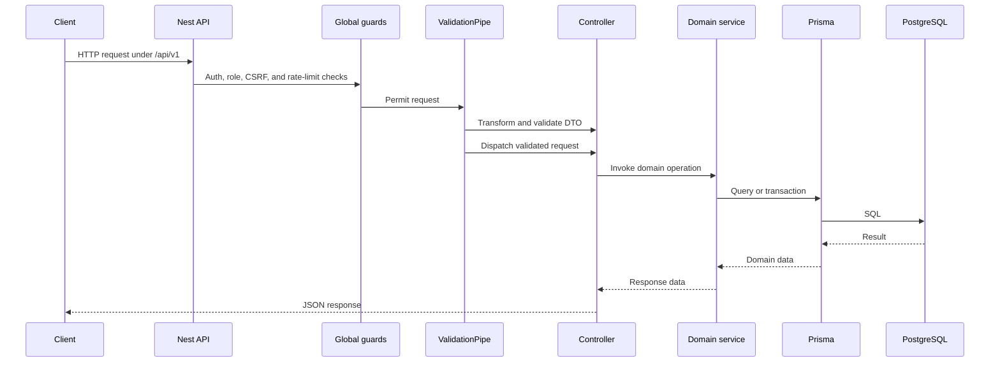
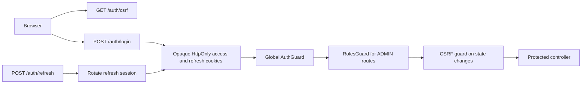
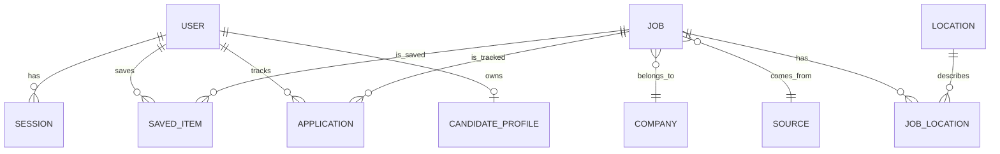
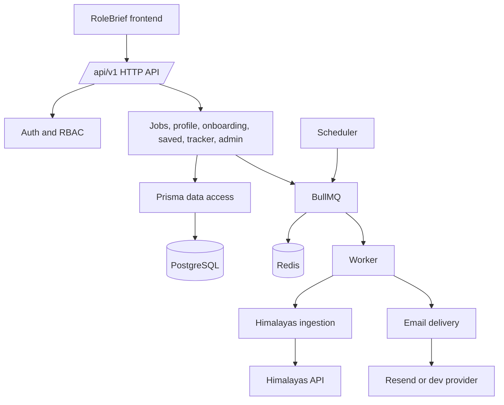

# RoleBrief - Backend

<p align="center">
  <strong>Provider-neutral career intelligence API and processing platform.</strong><br />
  NestJS API, worker, scheduler, and PostgreSQL persistence for RoleBrief
</p>

[Frontend Documentation](../frontend/README.md)

## Overview

The backend is a NestJS modular monolith with three entrypoints: an HTTP API, a BullMQ worker, and a scheduler. It serves public job discovery, cookie-based authentication, candidate onboarding and profile workflows, saved jobs, application tracking, and admin user management. It also ingests job data from the enabled Himalayas provider and delivers auth email jobs.

## Tech Stack

| Technology | Purpose |
| --- | --- |
| NestJS 11 | HTTP API and application modules |
| TypeScript | Static typing and compilation |
| PostgreSQL 16 | Relational persistence |
| Prisma 6 | ORM, generated client, and migrations |
| Redis 7 | Health checks, rate limits, and BullMQ backing store |
| BullMQ | Ingestion and email delivery queues |
| Argon2 | Password hashing |
| Swagger | API documentation at `/api/docs` |
| Helmet and Pino | Security headers and structured logging |

## Backend Architecture



## Project Structure

```text
src/
├── auth/             Sessions, cookies, CSRF, RBAC, password, and email flows
├── admin/            Admin user-management API
├── common/            Configuration, logging, and shared rate-limit support
├── health/            Liveness and PostgreSQL/Redis readiness checks
├── modules/           Jobs, saved, tracker, profile, onboarding, and product domains
├── providers/         Provider adapters, ingestion orchestration, and persistence
├── queue/             BullMQ registration, queue names, and Redis probing
├── scheduler/         Recurring provider synchronization
├── prisma/             Prisma module and database service
├── main.ts             HTTP API bootstrap
├── worker.ts           Worker application-context bootstrap
└── scheduler.ts        Scheduler application-context bootstrap
prisma/
├── schema.prisma      Database schema
└── migrations/        Versioned Prisma migrations
```

## Request Lifecycle



## Modules and API Groups

All HTTP routes use the global `/api/v1` prefix. Controllers are grouped by domain:

- **Health:** `/health/live` and `/health/ready`.
- **Authentication:** signup, login, logout, refresh, current user, sessions, email verification, password recovery, password change, and logout-all under `/auth`.
- **Jobs:** public search, facets, job details, and related jobs under `/jobs`.
- **Saved jobs:** authenticated saved-job listing, slug listing, save, and unsave under `/saved`.
- **Candidate workflows:** onboarding under `/me/onboarding` and profile under `/me/profile`.
- **Application tracker:** cursor-paginated applications, details, create, update, archive, restore, and delete under `/tracker`.
- **Administration:** user listing, user details, role changes, and status changes under `/admin`.

The application registers news, companies, matching, eligibility, and alerts module boundaries, but the current backend does not expose controllers for those domains. The frontend screens for several of them therefore remain fixture-backed or local-only.

DTOs use `class-validator` and `class-transformer`; the global validation pipe transforms input, whitelists fields, and rejects non-whitelisted fields. Swagger documents the API at `http://127.0.0.1:3000/api/docs`.

## Authentication and Authorization



Passwords are hashed with Argon2. Sessions are stored as hashed access/refresh credentials, refresh sessions rotate and can be revoked individually or globally, and authenticated state-changing requests require the `rb_csrf` cookie plus `x-rolebrief-csrf` header. Accounts must be verified and active before normal authenticated access. Roles are `USER` and `ADMIN`; admin routes require `ADMIN`. Redis-backed limits protect login, signup, recovery, refresh, and tracker operations.

## Database

Prisma reads `DATABASE_URL` and generates the client from `prisma/schema.prisma`. Migrations are stored in `prisma/migrations`. The schema groups entities into:

- **Identity:** `User`, `Session`, verification/reset tokens, auth audit events, and email deliveries.
- **Job catalog:** `Company`, `Job`, `Location`, `JobLocation`, `Source`, `ProviderRecord`, `JobOccurrence`, and `Salary`.
- **Candidate activity:** `SavedItem`, `Application`, `ApplicationHistory`, and alerts/deliveries.
- **Profile:** onboarding progress, candidate profile, preferences, and skills.
- **Ingestion audit:** ingestion runs, checkpoints, freshness events, and audit events.



## Background Processing and Integrations

The scheduler creates recurring `providers.himalayas.ingest` jobs when `HIMALAYAS_ENABLED=true`. The worker consumes provider ingestion and `auth.email.send` jobs. Ingestion validates and normalizes provider records, persists jobs and provider history through Prisma, records checkpoints and run metrics, and supports retry, delay, backfill, incremental, and smoke modes. Queue names also include verification, enrichment, and alerts for the broader queue boundary; only the ingestion and auth email processors are currently registered.

Implemented external integrations:

- **Himalayas:** job provider at the configured `HIMALAYAS_API_URL`.
- **Resend or development email provider:** verification, recovery, and password-change notifications. Resend is optional; development defaults to the fake provider.

## Environment Variables

Copy `.env.example` to `.env` and keep real credentials out of version control.

| Variable group | Variables | Purpose |
| --- | --- | --- |
| Runtime | `NODE_ENV`, `PORT`, `LOG_LEVEL` | Process mode, HTTP port, and logging |
| Browser/API | `PUBLIC_APP_URL`, `FRONTEND_ORIGIN` | Public links and exact credentialed CORS origins |
| Persistence | `DATABASE_URL`, `DATABASE_POOL_SIZE`, `REDIS_URL` | PostgreSQL and Redis connections |
| Queues | `QUEUE_PREFIX`, `WORKER_CONCURRENCY` | BullMQ namespace and worker capacity |
| Auth | `AUTH_ISSUER`, `AUTH_AUDIENCE`, `SESSION_SECRET`, `CURSOR_SIGNING_SECRET`, `ACCESS_TOKEN_TTL`, `REFRESH_SESSION_TTL`, `COOKIE_SECURE`, `COOKIE_SAME_SITE` | Session and cookie configuration |
| Limits | `AUTH_RATE_LIMIT_LOGIN`, `AUTH_RATE_LIMIT_SIGNUP`, `AUTH_RATE_LIMIT_RECOVERY`, `AUTH_RATE_LIMIT_REFRESH`, `TRACKER_RATE_LIMIT_READ`, `TRACKER_RATE_LIMIT_MUTATE`, `TRACKER_RATE_LIMIT_DELETE`, `RATE_LIMIT_FAIL_CLOSED` | Abuse and tracker limits |
| Email | `EMAIL_PROVIDER`, `EMAIL_DELIVERY_ENABLED`, `EMAIL_EXPOSE_DEV_LINKS`, `EMAIL_FROM`, `RESEND_FROM_EMAIL`, `RESEND_REPLY_TO`, `SMTP_URL`, `RESEND_API_KEY` | Email provider and delivery settings |
| Admin bootstrap | `BOOTSTRAP_ADMIN_ENABLED`, `BOOTSTRAP_ADMIN_EMAIL`, `BOOTSTRAP_ADMIN_PASSWORD` | Explicit initial admin creation |
| Himalayas | `HIMALAYAS_ENABLED`, `HIMALAYAS_API_URL`, `HIMALAYAS_PAGE_LIMIT`, `HIMALAYAS_REQUEST_TIMEOUT_MS`, `HIMALAYAS_INITIAL_BACKFILL_MAX_PAGES`, `HIMALAYAS_SYNC_MAX_PAGES`, `HIMALAYAS_REQUEST_DELAY_MS`, `HIMALAYAS_UNCHANGED_STOP_THRESHOLD`, `HIMALAYAS_MAX_RETRIES`, `HIMALAYAS_RETRY_DELAY_MS`, `HIMALAYAS_RATE_LIMIT_DELAY_MS`, `HIMALAYAS_CRON`, `HIMALAYAS_LIVE_SMOKE`, `HIMALAYAS_LIVE_SMOKE_PERSIST` | Provider ingestion behavior |
| Optional telemetry | `APITUBE_API_KEY`, `OTEL_EXPORTER_OTLP_ENDPOINT`, `SENTRY_DSN` | Optional integration/telemetry configuration |

Secret values are intentionally omitted from this documentation.

## Local Development

Prerequisites are Node.js, pnpm, and Docker Desktop. From the repository root, start PostgreSQL and Redis:

```powershell
docker compose up -d postgres redis
```

From `backend`:

```powershell
Copy-Item .env.example .env
pnpm install
pnpm prisma:generate
pnpm migrate:dev
pnpm dev:api
```

The API defaults to port `3000`. Seed data with `pnpm db:seed` when needed. Use `pnpm migrate:deploy` for an existing database and `pnpm exec prisma studio` to inspect it.

For a full Compose backend, use `docker compose up -d postgres redis api worker scheduler`, then apply tools with `docker compose --profile tools run --rm migrate` or seed with the corresponding `seed` service. Stop services with `docker compose down`; add `-v` only when intentionally deleting local volumes.

## Build and Production Processes

```powershell
pnpm build
pnpm start:api
pnpm start:worker
pnpm start:scheduler
```

The API, worker, and scheduler use the same compiled backend image in Compose and select behavior by entrypoint command.

## Testing and Quality

```powershell
pnpm test
pnpm typecheck
pnpm lint
```

Tests use Node's built-in test runner with `tsx` and cover auth, email, jobs, onboarding, saved jobs, tracker, HTML sanitization, Himalayas normalization/ingestion, and scheduler behavior. The jobs integration test requires a configured `DATABASE_URL`.

## Security

Verified controls include global authentication and role guards, Argon2 password hashing, opaque HttpOnly cookies, refresh rotation and revocation, CSRF protection, exact-origin credentialed CORS, Helmet headers, DTO validation, Redis-backed rate limiting, generic recovery responses to reduce account enumeration, structured logging, and token-hash storage for verification/reset records.

## Backend Architecture Diagram


