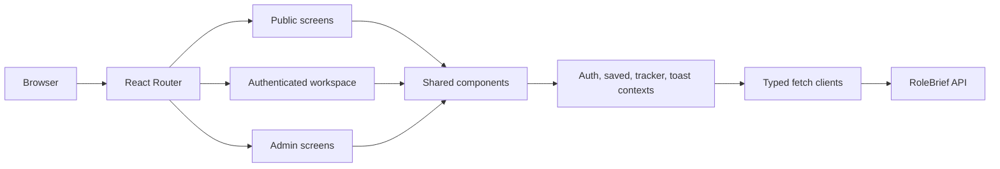
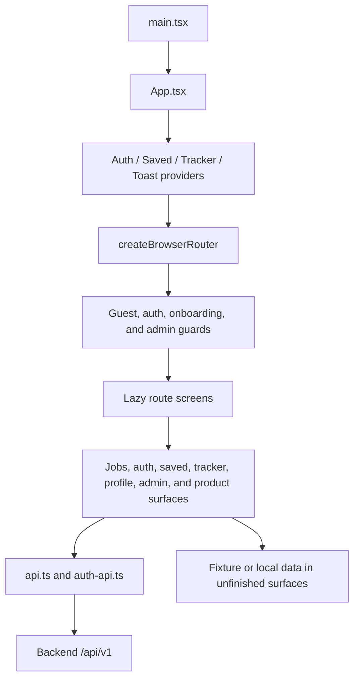

# RoleBrief - Frontend

<p align="center">
  <strong>Career intelligence for finding, evaluating, and tracking opportunities.</strong><br />
  React 19 interface for the RoleBrief platform
</p>

[Backend Documentation](../backend/README.md)

## Overview

The frontend is a Vite-powered React single-page application. It provides public job discovery, authentication, onboarding, a signed-in workspace, saved jobs, application tracking, candidate profile management, and admin screens. Route-level screens are lazy-loaded through React Router.

The current UI is broader than the API surface. Jobs, authentication, saved jobs, tracker, onboarding, profile, and admin user management use the backend API. News, company pages, compare, alerts, notifications, and some admin views still contain fixture or local-only behavior and should not be treated as fully persisted backend features.

## Tech Stack

| Technology | Purpose |
| --- | --- |
| React 19 | UI and component composition |
| TypeScript | Static typing |
| React Router 8 | Browser routing, guards, redirects, and lazy screens |
| Vite 8 | Development server and production bundling |
| Tailwind CSS 4 | Utility styling through the Vite plugin |
| Recharts | Data visualizations |
| lucide-react | Interface icons |
| oxfmt | Formatting |

## Architecture



## Project Structure

```text
src/
├── app/             Route definitions, guards, and fallbacks
├── components/      Shells, auth flows, tracker UI, and reusable UI primitives
├── layouts/         Dedicated layout wrappers such as onboarding
├── lib/             API clients, auth, saved-job, and tracker contexts
├── screens/         Route-level public, workspace, and admin screens
├── imports/         Product and design source documents
├── App.tsx          Provider composition and router entry
└── main.tsx         React DOM entrypoint and global CSS import
```

## Application Flow

The browser resolves a route in `src/app/routes.tsx`, applies guest, auth, onboarding, or admin guards, and lazy-loads the screen. Screens compose shared components and context providers. API-backed workflows call `src/lib/api.ts` or `src/lib/auth-api.ts`, send browser credentials when needed, and translate HTTP, timeout, parse, and network failures into `ApiError` values for UI handling.

## Features

- Public job search, filtering, facets, job details, related jobs, and source attribution.
- Email/password signup, login, verification, password recovery, reset, session management, and logout.
- Authenticated radar, saved jobs, application tracker, onboarding, profile, settings, and account workflows.
- Admin user listing and user role/status management.
- Product surfaces for news, companies, compare, alerts, notifications, and moderation, with several currently fixture-backed or local-only.

## Routing

| Group | Routes | Access |
| --- | --- | --- |
| Public discovery | `/`, `/jobs`, `/jobs/:slug`, `/companies/:slug` | Public |
| Public information | `/how-it-works`, `/coverage`, `/sources-methodology`, `/about`, `/privacy`, `/terms` | Public |
| Authentication | `/login`, `/signup` | Guest-only |
| Recovery | `/forgot-password`, `/reset-password`, `/verify-email` | Public token flows |
| Onboarding | `/app/onboarding` | Authenticated |
| Workspace | `/app/radar`, `/app/jobs`, `/app/news`, `/app/saved`, `/app/compare`, `/app/alerts`, `/app/tracker`, `/app/notifications`, `/app/profile`, `/app/settings` | Authenticated |
| Administration | `/admin`, `/admin/sources`, `/admin/moderation` | Authenticated admin |

Root aliases such as `/radar`, `/saved`, `/tracker`, and `/settings` redirect to canonical `/app/*` routes. Unknown paths render the 404 screen.

## State and API Integration

`AuthProvider`, `SavedProvider`, `TrackerProvider`, and `ToastProvider` are composed in `App.tsx`. Screen-local state handles filters, dialogs, and view state; provider contexts coordinate auth/session state, saved-job state, tracker state, and notifications. There is no separate server-state or cache library.

The API base URL is resolved in `src/lib/api.ts`:

- `VITE_API_BASE_URL`, when provided, is the explicit base URL.
- Otherwise the app uses the current browser hostname on port `3000` with `/api/v1`.
- Requests use `fetch`, an eight-second default timeout, abort propagation, JSON parsing, and typed `ApiError` handling.
- Auth requests use browser cookies and CSRF handling implemented in `auth-api.ts`.

## Environment Variables

| Variable | Required | Purpose |
| --- | --- | --- |
| `VITE_API_BASE_URL` | No | Override the backend API base URL. Default: `http://<browser-host>:3000/api/v1`. |
| `PORT` | No | Vite development and preview port; defaults to `8443`. |
| `FIGMA_DEV_SERVER_HOST` | No | Vite host override used by the existing configuration. |
| `FIGMA_PUBLIC_URL` | No | Vite base path override used by the existing deployment integration. |

Do not put backend credentials or provider keys in frontend variables.

## Development

From this directory:

```powershell
pnpm install
pnpm dev
```

Vite defaults to `http://localhost:8443`. API-backed screens require the backend; see the [backend README](../backend/README.md).

## Build and Preview

```powershell
pnpm build
pnpm preview
pnpm format
```

## Testing

`package.json` does not define a frontend test script. Repository specs exist for API helpers, job pagination, routing, saved jobs, and tracker behavior, but they are not wired to a package-level test command yet.

## Frontend Architecture Diagram



## Related Documentation

- [Backend README](../backend/README.md)
- [Root Docker Compose](../docker-compose.yml)
