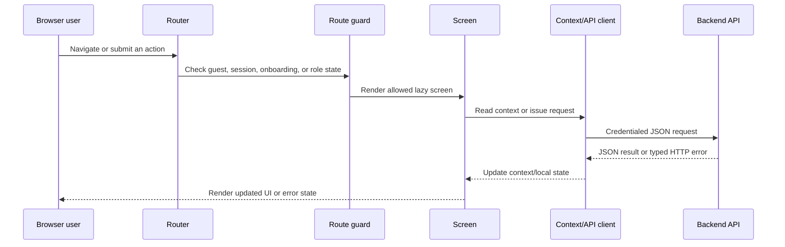
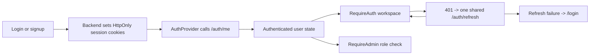

<!--
AI AGENTS:
This README is living technical documentation. Read it before modifying this application.
Update it when implementation changes documented behavior. Do not allow documentation drift.
-->

<div align="center">

# RoleBrief

### Frontend Application

**Career intelligence for finding, evaluating, and tracking opportunities.**

[](https://react.dev/)
[](https://www.typescriptlang.org/)
[](https://vite.dev/)
[](https://tailwindcss.com/)

[Backend Documentation](../backend/README.md) · [Root Compose](../docker-compose.yml)

</div>

> **Documentation status:** living documentation reviewed against the current repository on **2026-09-09**.

## 🧭 Navigation

[Overview](#-overview) · [Features](#-features) · [Architecture](#️-architecture) · [Routes](#️-route-map) · [Flows](#-application-flows) · [State](#-state-management) · [API](#-frontend--backend-communication) · [Auth](#-authentication--authorization) · [Setup](#-development) · [Testing](#-testing) · [Deployment](#-deployment) · [AI Protocol](#-ai-agent-documentation-protocol)

## 🌟 Overview

RoleBrief is a career-intelligence product centered on discovering and evaluating remote-friendly job opportunities. This React single-page application is the browser-facing layer: it renders public discovery pages, account flows, the authenticated workspace, candidate setup, job-saving and application-tracking experiences, and administrative screens.

The frontend communicates with the [NestJS backend](../backend/README.md) through credentialed JSON requests. The visible product surface is currently wider than the persisted API surface: jobs, authentication, saved jobs, tracker, onboarding, profile, and admin user management are API-backed; news, companies, compare, alerts, notifications, and some admin screens still use fixtures or local state.

### 👥 User roles

| Role | Verified access |
| --- | --- |
| Guest | Public discovery, information pages, and account recovery flows |
| `USER` | Authenticated onboarding, radar, jobs, saved jobs, tracker, profile, settings, and workspace screens |
| `ADMIN` | All authenticated user capabilities plus `/admin`, `/admin/sources`, and `/admin/moderation` routes |

The backend remains the authority for role and account status. The frontend admin guard provides the user experience for denied access; it is not a replacement for server authorization.

## ✨ Features

| Domain | Current behavior | Primary source |
| --- | --- | --- |
| Job discovery | Public search, filters, facets, job details, related jobs, pagination, and source attribution | [`src/screens/jobs`](src/screens/jobs) and [`src/lib/api.ts`](src/lib/api.ts) |
| Authentication | Signup, login, email verification, recovery, password reset/change, session listing, refresh, logout, and logout-all | [`src/screens/auth`](src/screens/auth) and [`src/lib/auth-api.ts`](src/lib/auth-api.ts) |
| Onboarding | Authenticated onboarding route with completion/skip gate behavior | [`src/screens/onboarding`](src/screens/onboarding) and [`src/components/auth/OnboardingGate.tsx`](src/components/auth/OnboardingGate.tsx) |
| Candidate workspace | Radar, profile, settings, saved jobs, and application tracker | [`src/screens`](src/screens) and [`src/lib`](src/lib) |
| Administration | Admin route guard, user operations screens, source view, and moderation view | [`src/app/RequireAdmin.tsx`](src/app/RequireAdmin.tsx) and [`src/screens/admin`](src/screens/admin) |
| Product extensions | News, companies, compare, alerts, notifications, and some moderation experiences | Current screens; several are fixture-backed or local-only |

## 🏗️ Architecture

```mermaid
flowchart LR
    USER["👤 Browser user"] --> ROUTER["🧭 React Router"]
    ROUTER --> GUARDS["🔐 Guest, auth, onboarding, admin guards"]
    GUARDS --> SCREENS["📄 Lazy route screens"]
    SCREENS --> COMPONENTS["🧩 Shells and UI components"]
    COMPONENTS --> CONTEXTS["🧠 Auth, saved, tracker, toast contexts"]
    CONTEXTS --> CLIENTS["🔌 api.ts and auth-api.ts"]
    CLIENTS --> API["⚙️ RoleBrief API /api/v1"]
    CLIENTS --> LOCAL["📦 Fixture or local data"]

    classDef ui fill:#e0f2fe,stroke:#0284c7,color:#0c4a6e
    classDef logic fill:#ede9fe,stroke:#7c3aed,color:#4c1d95
    classDef network fill:#dcfce7,stroke:#16a34a,color:#14532d
    classDef boundary fill:#ffedd5,stroke:#ea580c,color:#7c2d12
    class USER,ROUTER,SCREENS,COMPONENTS ui
    class GUARDS,CONTEXTS logic
    class CLIENTS,API network
    class LOCAL boundary
```



**Source map**

| Responsibility | Source |
| --- | --- |
| Provider composition | [`src/App.tsx`](src/App.tsx) |
| React entrypoint and global CSS | [`src/main.tsx`](src/main.tsx), [`src/index.css`](src/index.css) |
| Route tree and lazy loading | [`src/app/routes.tsx`](src/app/routes.tsx) |
| Authentication guard | [`src/app/RequireAuth.tsx`](src/app/RequireAuth.tsx) |
| Admin guard | [`src/app/RequireAdmin.tsx`](src/app/RequireAdmin.tsx) |
| API client and URL resolution | [`src/lib/api.ts`](src/lib/api.ts) |
| Auth client, refresh, and CSRF | [`src/lib/auth-api.ts`](src/lib/auth-api.ts) |
| Build and dev server | [`vite.config.ts`](vite.config.ts), [`package.json`](package.json) |

## 🗂️ Project Structure

```text
frontend/
├── public/                 Runtime public assets (currently theme bootstrap)
├── src/
│   ├── app/                Routes, guards, and route fallbacks
│   ├── components/         Shells, auth, tracker, and reusable UI primitives
│   ├── layouts/            Dedicated layouts such as onboarding
│   ├── lib/                API clients, contexts, routing, and utilities
│   ├── screens/            Public, auth, workspace, and admin screens
│   ├── imports/            Product/design source documents
│   ├── App.tsx             Provider composition and router entry
│   └── main.tsx            React DOM entrypoint
├── index.html              Vite HTML shell
├── vite.config.ts          Vite, React, Tailwind, alias, and server config
└── package.json             Dependencies and scripts
```

When changing a route, start with `src/app/routes.tsx`; when changing cross-screen session, saved, tracker, or notification behavior, inspect the matching provider in `src/lib` before editing a leaf screen.

## 🗺️ Route Map

| Group | Routes | Access | Purpose |
| --- | --- | --- | --- |
| Public discovery | `/`, `/jobs`, `/jobs/:slug`, `/companies/:slug` | Public | Landing, job catalog, job detail, company view |
| Public information | `/how-it-works`, `/coverage`, `/sources-methodology`, `/about`, `/privacy`, `/terms` | Public | Product and policy content |
| Account entry | `/login`, `/signup` | Guest-only | Sign in and create an account |
| Account actions | `/forgot-password`, `/reset-password`, `/verify-email` | Public token flows | Recovery and verification |
| Onboarding | `/app/onboarding` | Authenticated | Candidate setup and completion/skip flow |
| Workspace | `/app/radar`, `/app/jobs`, `/app/jobs/:slug`, `/app/news`, `/app/news/:slug`, `/app/saved`, `/app/compare`, `/app/alerts`, `/app/tracker`, `/app/notifications`, `/app/profile`, `/app/settings` | Authenticated | Signed-in product experience |
| Administration | `/admin`, `/admin/sources`, `/admin/moderation` | Authenticated `ADMIN` | Operations and moderation screens |
| Compatibility aliases | `/radar`, `/news`, `/saved`, `/tracker`, `/alerts`, `/compare`, `/notifications`, `/profile`, `/settings`, `/onboarding` | Redirects | Canonical `/app/*` destinations |

## 🔄 Application Flow



The generic request client uses an eight-second timeout, abort propagation, JSON parsing, and `ApiError` values. Auth requests can refresh once after a `401`, using a shared in-flight refresh promise so concurrent failures do not trigger multiple refresh requests.

## 🔁 Important Application Flows

### Job search

**Entry →** `/jobs` or `/app/jobs` → filter controls in the jobs screen → `listJobs()` and `getJobFacets()` → backend `/jobs` endpoints → cursor/page state updates → job cards and result metadata render.

### Authentication and session recovery

**Entry →** login/signup form → `authRequest()` → backend cookie session → `AuthProvider` loads `/auth/me` → protected routes render. A protected request receiving `401` calls `/auth/refresh` once, retries the original request, and redirects to login when refresh fails.

### Save a job

**Entry →** job card/detail action → `SavedProvider` → authenticated saved-job API request with credentials and CSRF for mutation → backend persists `SavedItem` → provider updates saved state and UI.

### Track an application

**Entry →** tracker screen or job action → tracker context/dialog → `/tracker` create/update/archive/restore/delete request → backend ownership and revision checks → tracker list, counts, and detail state update.

### Onboarding gate

**Entry →** `/app/*` workspace → `RequireAuth` → `OnboardingGate` reads authenticated onboarding state → render onboarding or workspace → onboarding autosave/skip/complete requests persist progress.

### Admin access

**Entry →** `/admin/*` → `RequireAdmin` checks authenticated user and `isAdmin` → render admin screen or a 403 state. Backend `RolesGuard` independently enforces `Role.ADMIN` on the API.

## 🧠 State Management

- **Component state:** filters, dialogs, form values, loading states, and screen-local presentation state.
- **Context state:** `AuthProvider`, `SavedProvider`, `TrackerProvider`, and `ToastProvider` coordinate cross-screen client state.
- **URL state:** route paths, slugs, query strings, and compatibility redirects preserve navigation context.
- **Server state:** fetched data is held by screens/providers; no React Query, Redux, Zustand, or dedicated cache library is configured.
- **Persistence:** durable state belongs to the backend; the frontend uses cookies for auth and in-memory CSRF state, not local token storage.

## 🔌 Frontend ↔ Backend Communication

`src/lib/api.ts` is the general JSON client. `src/lib/auth-api.ts` wraps auth requests with `credentials: "include"`, CSRF header acquisition, refresh retry behavior, and response error parsing. The base URL is `VITE_API_BASE_URL` when set; otherwise it is derived from the browser hostname at port `3000` with `/api/v1`.

There are no configured interceptors, retry policies beyond the auth refresh retry, or server-state cache. API-backed screens should use the existing clients rather than calling `fetch` directly.

## 🔐 Authentication & Authorization

- Auth uses opaque backend-managed cookies; the frontend does not store access or refresh tokens in local storage.
- `AuthProvider` establishes session state through `/auth/me` and exposes the current user, status, logout, and reload behavior.
- State-changing auth requests obtain the readable CSRF cookie and send `x-rolebrief-csrf`.
- `RequireAuth` preserves the attempted location in the login redirect and handles loading, session errors, logout, and unauthenticated states.
- `RequireAdmin` adds the client-side `ADMIN` check and renders a 403 experience for authenticated non-admin users.
- The backend remains authoritative for cookie validation, account status, roles, ownership, and CSRF enforcement.



## ⚙️ Environment Variables

| Variable | Required | Purpose |
| --- | --- | --- |
| `VITE_API_BASE_URL` | No | Explicit backend base URL; `.env.example` provides the local `/api/v1` value |
| `PORT` | No | Vite dev/preview port; defaults to `8443` |
| `FIGMA_DEV_SERVER_HOST` | No | Vite host override |
| `FIGMA_PUBLIC_URL` | No | Vite base path override in the existing Vite integration |

Only variable names and safe local defaults belong in tracked documentation. Never place backend credentials, API keys, or database URLs in frontend configuration.

## 🚀 Development

### Requirements

Node.js and pnpm are used by the repository. The frontend includes both `pnpm-lock.yaml` and `package-lock.json`; use pnpm for consistency with the workspace and backend.

### Install and configure

```powershell
cd frontend
pnpm install
Copy-Item .env.example .env.local
```

Adjust `VITE_API_BASE_URL` only when the API is not reachable at the local default.

### Run, build, and preview

```powershell
pnpm dev
pnpm build
pnpm preview
pnpm format
```

The configured default is `http://localhost:8443`. API-backed screens require the backend and its PostgreSQL/Redis services; see the [backend README](../backend/README.md).

## 🧪 Testing

The frontend package has no `test`, `lint`, or `typecheck` script. Source specs exist for auth API behavior, job pagination, routing, saved API behavior, and tracker API behavior, but no package-level test runner is configured in `package.json`. Do not document an unverified frontend test command as available.

## 📦 Deployment

The repository verifies Vite production bundling and preview behavior, but does not contain a frontend deployment target, hosting manifest, CI workflow, or production static-server configuration. `vite.config.ts` does expose `FIGMA_PUBLIC_URL` and `FIGMA_DEV_SERVER_HOST` integration points; deployment ownership beyond that is not established in the current repository.

## 🤖 AI Agent Documentation Protocol

This README is living technical documentation and part of the project source of truth.

**Before making changes:**

1. Read this README.
2. Inspect the relevant implementation and neighboring tests.
3. Identify whether the change affects features, flows, routes, API contracts, state, environment variables, integrations, setup, deployment, or security.

**After implementation:**

1. Update this README whenever implementation changes documented behavior.
2. Update affected Mermaid diagrams and source maps.
3. Update feature, route, and API documentation.
4. Update environment-variable and setup instructions when tooling changes.
5. Remove documentation for functionality that no longer exists.
6. Never document planned behavior as implemented behavior.

If this README disagrees with the implementation, treat the implementation as the current source of truth, verify the behavior, and update this README in the same change boundary whenever practical. Do not silently continue with known stale documentation.

### AI Agent Change Checklist

| Change made | README action |
| --- | --- |
| New feature or changed feature flow | Update Features and the relevant flow |
| New or changed route | Update Route Map and guards |
| API contract changed | Update API and communication sections |
| State behavior changed | Update State Management and flow diagrams |
| Authentication or authorization changed | Update Auth section and diagram |
| New environment variable | Update Environment Variables |
| Dependency or tooling changed | Update Tech Stack and commands if relevant |
| Folder/module moved | Update Project Structure and source map |
| Deployment behavior changed | Update Deployment |
| Security behavior changed | Update Security notes in this README and backend README when applicable |

## 📌 Documentation Status

- **Last architecture review:** 2026-09-09
- **Documentation scope:** Frontend
- **Source of truth:** Current repository implementation
- **Maintenance:** Required with architecture-affecting changes
- **Visual assets:** No verified product logo or screenshot asset was found for README embedding
